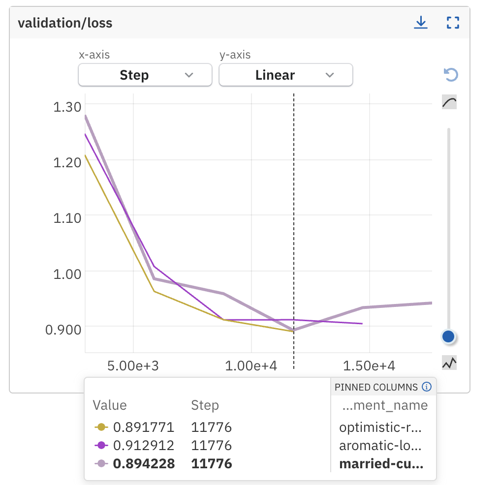
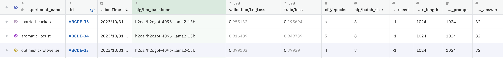
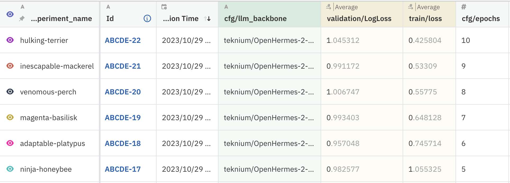
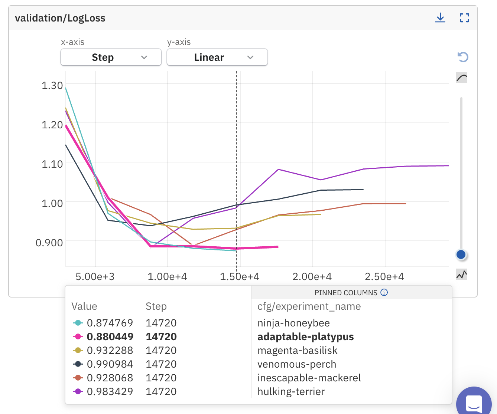
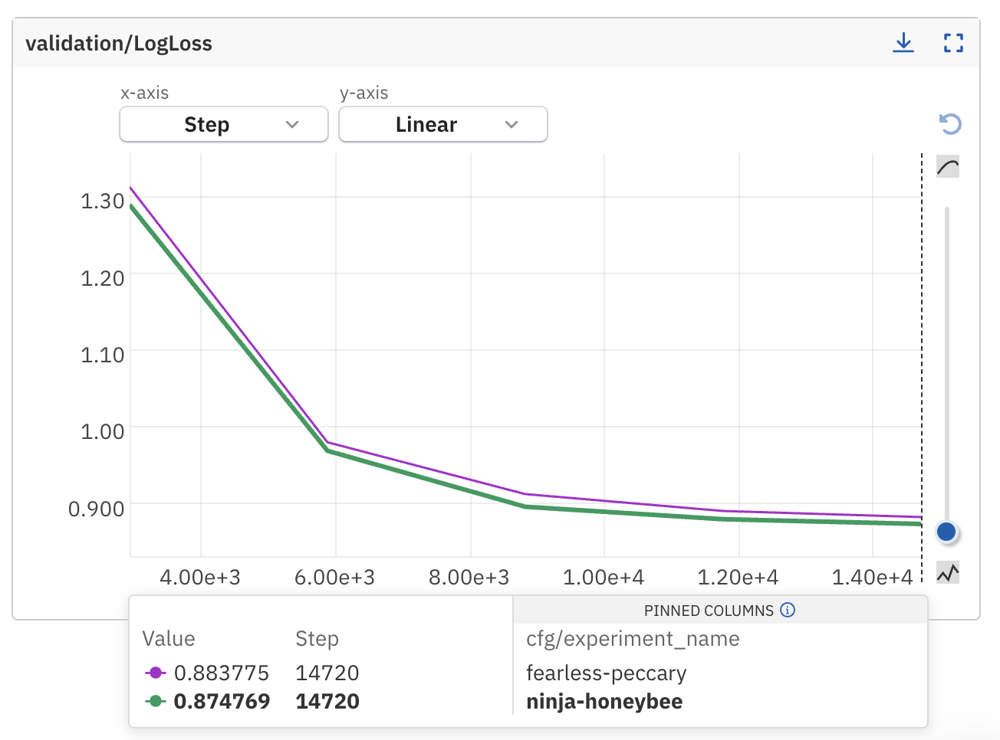
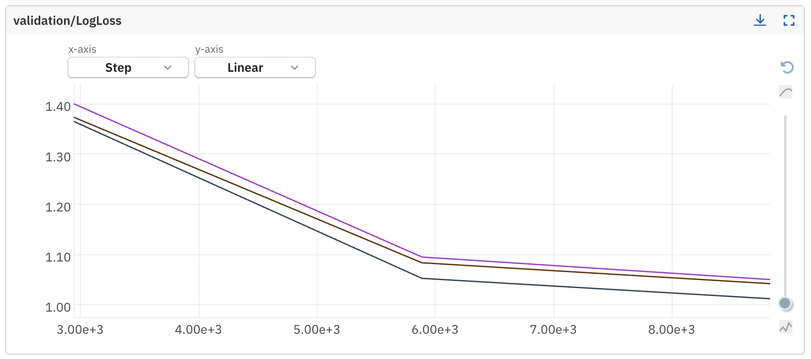
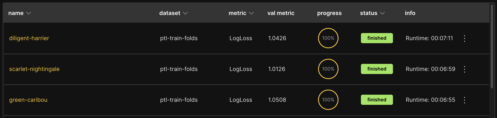

# Predict the LLM Kaggle Competition LogBook

Table of Contents
- [Experiment Summary](#experiments-summary)
- [Todo](#todo)
- [Code Snippets](#useful-code-snippets)
- [Links](#useful-links)
- [Tips and Tricks](#general-tips)
- [Ideas that didn't work](#ideas-that-didnt-work)

# Experiments Summary

|  Model | Size | Params | Val.Loss | LB | Params | Exp. Name
|--------|------|--------|----------|-----|--------|------|
| microsoft/deberta-v3-small| 286 MB | 44M | 1.58 | 1.65 | | - |
| microsoft/deberta-v3-base| 1.3GB | 86M | 1.63   | 1.64    | | - |
| microsoft/deberta-v3-large| 874 MB | 304M | ?   | ?    | | - |
| mistralai/Mistral-7B-Instruct-v0.1 | 15GB | 7B | 1.028   | 0.925   | max_len_prompt 256, max_len_answer 256, max_length 512, bs 16, epochs 3, int4| blond coua |
| mistralai/Mistral-7B-Instruct-v0.1 | 15GB | 7B | 1.00639  | 0.855   | max_len_prompt 256 -> 1024, max_len_answer 256 -> 32, max_length 512 -> 1024, bs 16, epochs 3, int4| hospitable-gibbon |
| mistralai/Mistral-7B-Instruct-v0.1 | 15GB | 7B | 0.945  | 0.736   | max_len_prompt 1024, max_len_answer 32, max_length 1024, bs 16, epochs 4, int4| delectable mushroom |


# Todo
- ~~Fix reproducibility~~
- ~~Cleaned up directory to make space for experiments~~
- ~~setup neptune logging~~
- ~~Reproduce 0.736 submission~~
- ~~HuggingFaceH4/zephyr-7b-beta which is on top of lmsys arena lb.~~
- ~~How much variance do we see across folds?~~
- ~~ehartford/dolphin-2.1-mistral-7b~~
- ~~teknium/OpenHermes-2-Mistral-7B~~
- ~~Run 6-10 epochs on Open Hermes 2~~
- ~~What is the accuracy improvement corresponding to the logloss improvement?~~
- ~~fix validation setup~~
- ~~Publish Visualization notebook - https://github.com/koaning/cluestar~~
- ~~CV-LB graph~~
- ~~Open-Orca/Mistral-7B-OpenOrca model~~
- ~~Pseudo labeling (add confident test samples to train data)~~
- ~~Llama-2-13b-hf~~
- ~~Effect of Prompt on Model Performance~~
- ~~Blends of 3 seeds for each model.~~
- script version
- Winning solution notebook #notebook


Deprioritized Experiments:
- Mistrallite / NousResearch/Yarn-Mistral-7b-128k -- not possible due to lack of support for flash_attn in H2O-LLMStudio
- btlm -- couldn't get it to working due to a bug
- Effect of Prompt on Model Performance #notebook low value seen
- https://www.kaggle.com/code/cdeotte/rapids-svr-cv-0-450-lb-0-44x #notebook
- openchat/openchat_3.5 - low performance
- Qwen/Qwen-14B - didn't work due to a bug mostly due to compatibility issues.
- 

## Experiment 19
Hypothesis: Would a user prompt be useful in this classification?

Prompt: Your task is to classify the following question answer pair into one of the seven categories. Think step by step. \n

| Date |
| -----|
| 2023-11-02|


### Findings
Adding a system prompt improved the performance in 3rd digit.

### Conclusion
Not considering this for now as this experiment is not the most optimal for progress.

---

## Experiment 18
Hypothesis: Are Llama-2-13b-hf models strong enough? Can they bring diversity into the ensemble?

| Date |
| -----|
| 2023-10-31|

### Experiment Setup
Consider h2oai/h2ogpt-4096-llama2-13b variant to avoid the license issue with hf/meta. Run 3 models with 3 different epochs.

### Findings




### Conclusion
- 4 epoch model is far better than the other two.
- Postponed.

---

## Experiment 17
Hypothesis: Pseudo Labeling?

| Date |
| -----|
| 2023-10-31|

### Experiment Setup
Consider teknium/OpenHermes-2-Mistral-7B backbone as a baseline.

### Findings

Single model
| Model | Val. LogLoss | LB |
|--------------|----------|-----------|
| groovy-crab | 0.8847 | 0.762 |
| pragmatic-platypus | NA | 0.74 |

Ensemble
| Model | Val. LogLoss | LB |
|--------------|----------|-----------|
| delectable-mushroom/hypersonic-bettong | 0.9260 | 0.736 |
| ~~groovy-crab~~ | ~~0.8847~~ | ~~0.762~~ |
| pragmatic-platypus | NA | 0.74 |
| berserk-vicugna | 0.8923 | 0.752 |
| fair-kiwi/topaz-starling | 0.9079 | 0.7 |

Local Average - NA
Public LB - 0.64

### Conclusion
Surprising that the LB score did not improve. That's okay. I think if I do this with multiple seeds, we might see an improvement.

---

## Experiment 16
Hypothesis: How good is Open-Orca/Mistral-7B-OpenOrca? Identify individual model performance and ensemble performance.

| Date |
| -----|
| 2023-10-30|

### Experiment Setup
Consider Mistral setup and use Open Orca backbone.

### Findings

Single model
| Model | Val. LogLoss | LB |
|--------------|----------|-----------|
| fair-kiwi/topaz-starling | 0.9079 | 0.7 |

Ensemble
| Model | Val. LogLoss | LB |
|--------------|----------|-----------|
| delectable-mushroom/hypersonic-bettong | 0.9260 | 0.736 |
| groovy-crab | 0.8847 | 0.762 |
| berserk-vicugna | 0.8923 | 0.752 |
| fair-kiwi/topaz-starling | 0.9079 | 0.7 |

Local Average - 0.9027
Public LB - 0.635

### Conclusion
Averaging more models is leading to nice logloss improvement.

---

## Experiment 15
Hypothesis: How much does an ensemble help?

| Date |
| -----|
| 2023-10-29|

### Experiment Setup
Average 3 top models.
Ensemble Strategy: mean

### Findings
| Model | Val. LogLoss | LB |
|--------------|----------|-----------|
| delectable-mushroom/hypersonic-bettong | 0.9260 | 0.736 |
| groovy-crab | 0.8847 | 0.762 |

Local Average - 0.9053
Public LB - 0.672

| Model | Val. LogLoss | LB |
|--------------|----------|-----------|
| delectable-mushroom/hypersonic-bettong | 0.9260 | 0.736 |
| groovy-crab | 0.8847 | 0.762 |
| berserk-vicugna | 0.8923 | 0.752 |

Local Average - 0.9010
Public LB - 0.661

### Conclusion
Model ensembling is giving a large boost. So, the final models should be a blend of multiple seeds/model and multiple models.

---

### Experiment 14
Hypothesis: What is the corresponding accuracy to logloss?

| Date |
| -----|
| 2023-10-29|

Computed accuracy from predictions of adaptable_platypus run.

| Val. LogLoss | Accuracy | AUC Score |
|--------------|----------|-----------|
| 0.957048 | 0.6790 | 0.9091 |


## Experiment 13
Hypothesis: Open Hermes 2 train loss was much higher than the best Mistral. Can it go for longer epochs?

| Date |
| -----|
| 2023-10-29|

### Experiment Setup
Run 6/7/8/9/10 epoch Open Hermes models and compare val losses.

### Findings



### Conclusions

---
Open Hermes2 6 epochs is marginally better than 5. However, longer epochs tend to massively overfit.


### Experiment 12
Hypothesis: Is [Open Hermes 2 finetune](https://huggingface.co/teknium/OpenHermes-2-Mistral-7B) better than Mistral backbone?

| Date |
| -----|
| 2023-10-29|

### Experiment Setup
Compare the 5-epoch Mistral model vs Open Hermes 2 model.

### Findings


The validation score improves by ~0.01 with the Open Hermes 2 model. Ninja Honeybee is the Open Hermes 2 model.

### Conclusions
Open Hermes 2 might be useful in the final ensemble!

---

## Experiment 11
Hypothesis: Does an ensemble give a massive boost?

| Date |
| -----|
| 2023-10-28|

### Experiment Setup
Pick the 0.736 model. Also, pick the 0.79 model (5 epochs run). Average and see the LB score.

### Findings
The LB score is 0.699 logloss. The boost is 0.04 which is massive.


### Conclusions
Goes on to show how ensembling multiple models is key to achieving a lower logloss.

---


## Experiment 10
Hypothesis: Is the logloss between multiple runs small or large?

| Date |
| -----|
| 2023-10-27|

### Experiment Setup
Pick a configuration (model, lr, batch size, ....) and run it 3 times and observe the train/validation loss/logloss metrics.

### Findings



### Conclusions
The plots clearly show that there is a variance of 0.015. To take this into account, the final submission should be a blend of 3+ models. (3 is anecdotal).

---

## Experiment 9
Hypothesis: Zephyr-7b-beta is launched today and apparently, it's the top in open_llm_leaderboard. Let's try it out!

| Date |
| -----|
| 2023-10-27|

## Experiment Setup
Run the `zephyr-7b-beta` model with the best performing mistral model hyperparameters and observe results.

### Findings
| Scenario | Validation LogLoss| Train LogLoss| 
| ---------|-------------------|---------|
| mistralai/Mistral-7B-Instruct-v0.1 | 0.945 | 0.65 |
| HuggingFaceH4/zephyr-7b-beta |  1.033 | 0.40 |

### Conclusions
Mistral >>> Zephyr.

---

## Experiment 8
Hypothesis: Let's reproduce the 0.736 submission!

| Date |
| -----|
| 2023-10-27|

### Experiment Setup
Run the 0.736 configuration once again with a random seed of 0 and submit to LB.

### Findings
LB score is 0.79 but not 0.736.

### Conclusions
This confirms that random seed has a lot of impact on logloss. I find it surprising that the effect is so large but there's enough evidence on public domain that this is common in finetuning large neural nets. Read the reproducibility point in the tips section. [link](#general-tips).

Note: We need to submit a blend towards the end to create stability in predictions.

---

## Experiment 7
Hypothesis: Is ehartford dolphin model better than mistral FM?

| Date |
| -----|
| 2023-10-27|

### Experiment Setup
Compare mistral model run with ehartford dolphin model run. Compare the train loss and val loss for both the models.

### Findings

| Scenario | Validation LogLoss| Train LogLoss| 
| ---------|-------------------|---------|
| mistralai/Mistral-7B-Instruct-v0.1 | 0.945 | 0.65 |
| ehartford/dolphin-2.1-mistral-7b |  0.9396 | 0.62 | 

### Conclusions
Even though the train loss and validation loss look slightly better, when I submitted this to the leaderboard, the public LB score was 0.936 which was much worser than the 0.736 score for Mistral model.

Note: A blend of 3 seeds for each model needs to be checked.

---

## Experiment 6
Hypothesis: Is ehartford dolphin model better than mistral FM?

| Date |
| -----|
| 2023-10-27|

### Experiment Setup
Compare mistral model run with ehartford dolphin model run. Compare the train loss and val loss for both the models.

### Findings

| Scenario | Validation LogLoss| Train LogLoss| 
| ---------|-------------------|---------|
| mistralai/Mistral-7B-Instruct-v0.1 | 0.945 | 0.65 |
| ehartford/dolphin-2.1-mistral-7b |  0.9396 | 0.62 | 

### Conclusions
Even though the train loss and validation loss look slightly better, when I submitted this to the leaderboard, the public LB score was 0.936.

---

## Experiment 5
Hypothesis: Is 4 epochs better than 3 epochs?

| Date |
| -----|
| 2023-10-26|

### Experiment Setup
Compare r=8 result with r=4 result. Compare the train loss and val loss for the 4 epoch run with the 3 epoch run.

### Findings

| Scenario | Validation LogLoss| Train LogLoss| 
| ---------|-------------------|---------|
| 3 epoch run .. max_length_prompt 1024, max_len_answer 32, max_length 1024 | 1.028 | - | 
| 4 epoch run .. max_length_prompt 2048, max_len_answer 32, max_length 2080 | 0.945 | 0.65 | 

### Conclusions
Great. Looks like 4 epochs is a better setup. Let's do a full finetune and submit to LB.

Update: LB jumped by from 0.855 to 0.736. That's a mega improvement :)

I still need to find a way to sync my val scores to lb scores.

---

## Experiment 4
Hypothesis: Is LoRA with rank of 8 better than rank of 4?

| Date |
| -----|
| 2023-10-26|

### Experiment Setup
Compare r=8 result with r=4 result. Compare the 3 epoch runs for faster exploration and $.

### Findings

| Scenario | Validation LogLoss|
| ---------|-------------------|
| LoRA r=4 | 1.028 |
| LoRA r=8 | 1.08536 |

### Conclusions
r=4 finetuning seems to be better on validation set. This isn't completely conclusive as we might want to run this model later on larger epochs and training stability could be different.


---

## Experiment 3
Hypothesis: Is bfloat16 better than int4?

| Date |
| -----|
| 2023-10-25|

### Experiment Setup
Compare int4 result with bfloat16 result? Compare the 3 epoch runs for faster exploration and $ reasons.

### Findings

| Scenario | Validation LogLoss|
| ---------|-------------------|
| Int4 | 1.028 |
| bfloat16 |  1.03694 |

### Conclusions
It looks like bfloat might not be better than int4 finetuning.

---


# Useful Code Snippets
```
train.to_csv("ptl-train.csv", index=False)
test['target'] = 0
test.to_csv("ptl-test.csv", index=False)
```

# Useful Links
- **Mardown Basics**: https://docs.github.com/en/get-started/writing-on-github/getting-started-with-writing-and-formatting-on-github/basic-writing-and-formatting-syntax
- **LMSys Leaderboard for Open Source Models** - https://chat.lmsys.org/
- **Facebook OPT Model Logbooks** - https://github.com/facebookresearch/metaseq/tree/main/projects/OPT/chronicles
- **Sbert Pretrained Models** - https://www.sbert.net/docs/pretrained_models.html
- **Text Classification: All Tips and Tricks from 5 Kaggle Competitions** - https://neptune.ai/blog/text-classification-tips-and-tricks-kaggle-competitions
- **Pseudo Labeling** - https://www.kaggle.com/code/cdeotte/pseudo-labeling-qda-0-969/notebook#Step-3-&-4---Add-pseudo-label-data-and-build-second-model
- **Classification Inference** - https://github.com/h2oai/h2o-llmstudio/blob/b86709a22fadfa2d44893d166b2476db45ef96c5/model_cards/text_causal_classification_experiment_summary_card_template.md

# General Tips:
- **Reproduciblity:** Set `random_seed` to 0 or any other number for reproducibility. Otherwise, a randomly generated seed is used for your experiments.
    - Here are a few reasons you do not want to.
        - https://www.kaggle.com/competitions/feedback-prize-effectiveness/discussion/347536
        - https://twitter.com/ph_singer/status/1696877654497013835
- **Validation Setup:** Ensure `Train validation data` is off. Otherwise, models are trained on `training data + validation data` which might not be what you expect at the first thought.
- **Disk Usage:** After a few experiments with llms, your disk size goes through the roof because each new LLM backbone occupies space on your hard drive. 2 things now.
    - These files are available in your `.cache/huggingface/hub/` directory.
        - Command to find the large files - `find . -type f -name "*safetensors"`
    - Regular housekeeping on disk usage is recommended. Keep removing files! :D
    -   To sort all files in a directory in linux, use `du -h . | sort -rh`
    - To create zip files, use `zip [file_name.zip] [file_name1] [file_name2]`
    - Periodically, remove files to have enough disk space. Use `rm output/user/*/*.pth`.
- **See Text in Clusters** - https://github.com/koaning/cluestar
- psi favorite models
    - Llama-2-13b-hf
    - Mistral-7B-v0.1, Llama-2-7b-hf, xgen-7b-8k-base (underrated)
    - btlm-3b-8k-base
    - TinyLlama-1.1B (looks promising, unfortunately only 2k context)

# Ideas that didn't work
- Even though `ehartford/dolphin-2.1-mistral-7b` is a mistral finetune and shows up above Mistral models on Open LLM leaderboard, it did not do well for classification.
- 